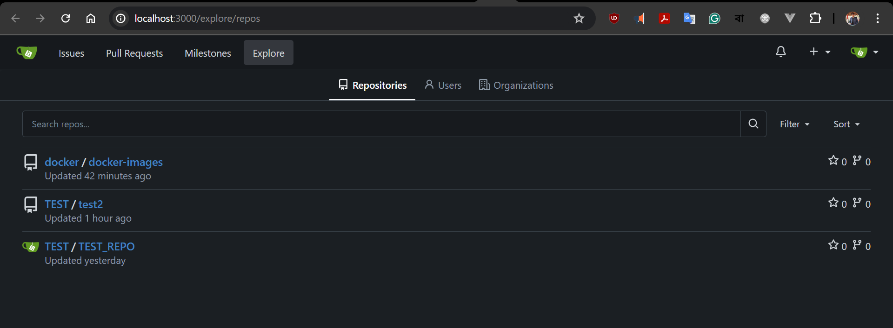
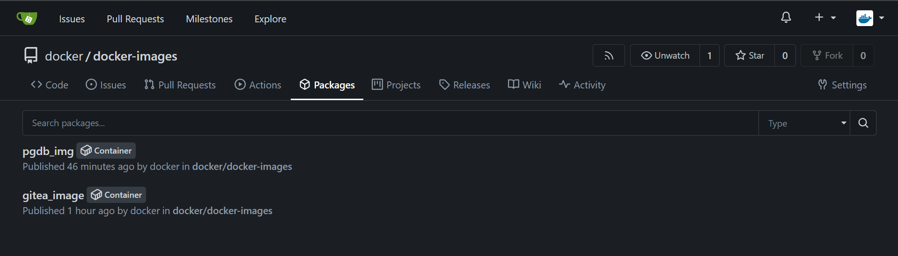
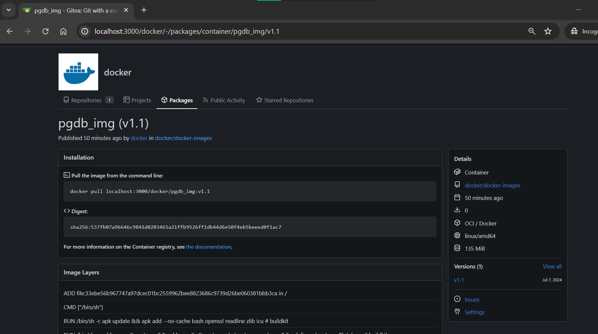
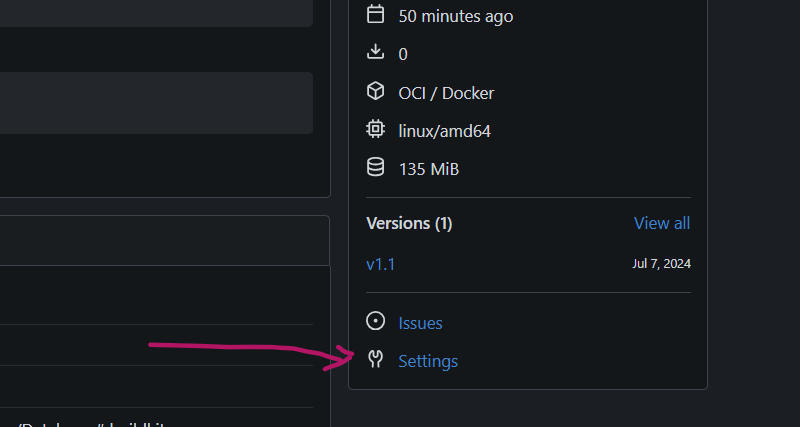

# Docker Compose Setup for Gitea and PostgreSQL


This repository contains Docker Compose configurations for setting up `Gitea` and `PostgreSQL` services. Below are the details of the two Docker Compose YAML files.

## docker-compose.yml

This compose file references local images created using the following commands:

```sh
# Create Docker network
docker network create gitea-network

# Create and run PostgreSQL container
docker run -d --name="gitea_db" --restart=on-failure:2 --hostname=postgres --network gitea-network -p 5432:5432 -v pgdb_data:/postgres/Database pgdb_img:v1.1

# Build and run Gitea container
docker build -t gitea_image:v1.0 .
docker run -d --name="gitea_c1" --restart=on-failure:2 --network gitea-network -p 3000:3000 -v gitea_data:/gitea gitea_image:v1.0
```

| Service      | Image/Build Path | Ports     | Networks      | Volumes                      | Additional Info    |
| ------------ | ---------------- | --------- | ------------- | ---------------------------- | ------------------ |
| gitea_server | gitea_image:v1.0 | 3000:3000 | gitea-network | gitea_data:/gitea            |                    |
| db_server    | pgdb_img:v1.1    | 5432:5432 | gitea-network | pgdb_data:/postgres/Database | hostname: postgres |

### Networks

| Network Name  |
| ------------- |
| gitea-network |

### Volumes

> this volumes came from previous day container creation from image of gitea and postgres.
> I reused it as it hold the previous state of gitea

| Volume Name | External | Name       |
| ----------- | -------- | ---------- |
| pgdb_data   | true     | pgdb_data  |
| gitea_data  | true     | gitea_data |

### buildImg_docker-compose.yml

> this compose any one can use to start a **fresh gitea instance** in docker with **postgres setup**

| Service      | Build Path        | Ports     | Networks      | Volumes                      | Additional Info                                                |
| ------------ | ----------------- | --------- | ------------- | ---------------------------- | -------------------------------------------------------------- |
| gitea_server | ./Gitea_Images    | 3000:3000 | gitea-network | gitea_data:/gitea            | tags: "gitea_img:v1.2", "localhost:3000/docker/gitea_img:v1.2" |
| db_server    | ./Postgres_Images | 5432:5432 | gitea-network | pgdb_data:/postgres/Database | hostname: postgres                                             |

### Networks

| Network Name  |
| ------------- |
| gitea-network |

### Volumes

> **in this case the volumes will get created if not existed**

| Volume Name | External | Name |
| ----------- | -------- | ---- |
| pgdb_data   |          |      |
| gitea_data  |          |      |

---

This setup helps in managing Gitea and PostgreSQL containers, ensuring that they can communicate over a common network and persist data using Docker volumes.

----
# Gitea Up & Running
----


#### Step 1:
> Here I have created one user : **`docker`** through admin panel of **`gitea`**. Then after logged into that `docker` user created a repo called : `docker-images`

#### Step 2:
in terminal logged into that same docker user through docker
>```docker
>docker login localhost:3000
>```
Created tag from existing image using below command for `gitea` and `postgres` image 
>```docker
>docker tag gitea_image:v1.0 localhost:3000/docker/gitea_image:v1.0
>```
and pushed to `gitea` :
>```docker
>docker push localhost:3000/docker/gitea_image:v1.0
>```

and same for `postgres` :
>```docker
>docker tag gitea_image:v1.1 localhost:3000/docker/postgres:v1.1
>```
>```docker
>docker push localhost:3000/docker/postgres:v1.1
>```

> 
>
> 

#### Step 3:
from settings of each container assigned the repo name 
> 